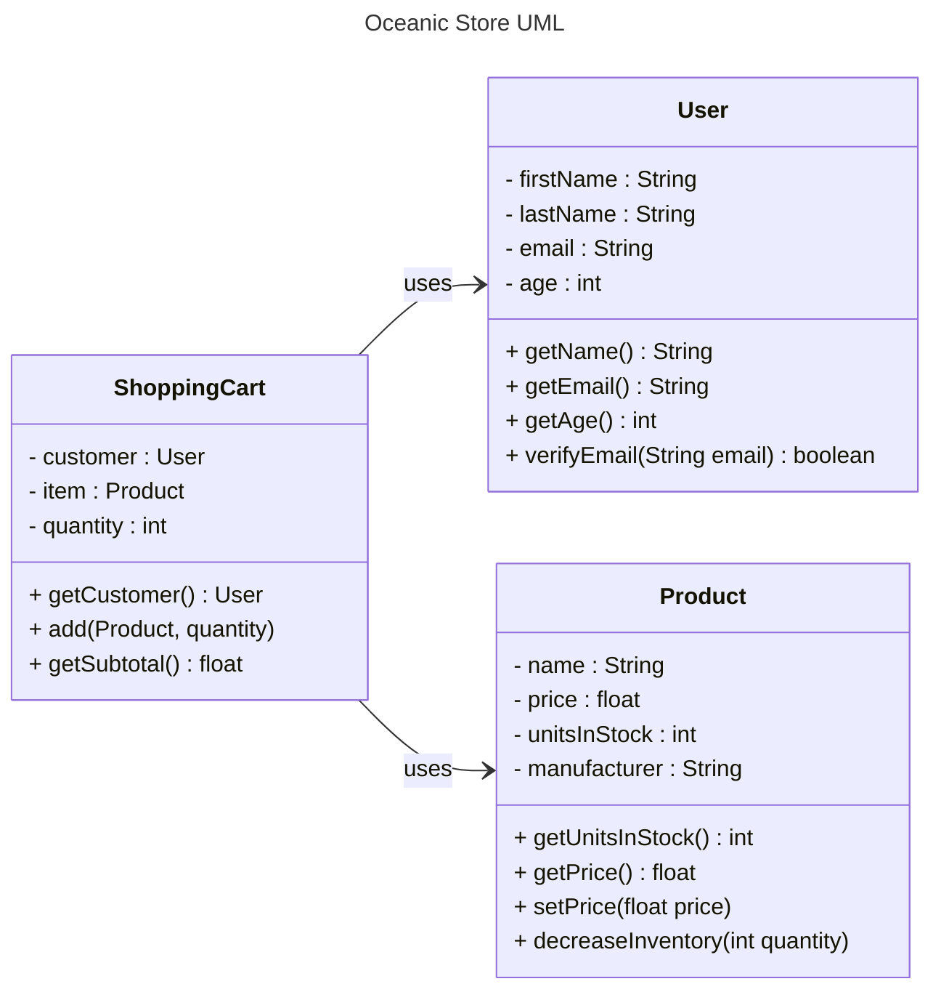

```mermaid
---
title: Oceanic Store UML
---
classDiagram
    direction LR
    ShoppingCart --> User : uses
    ShoppingCart --> Product : uses
    class User {
        - firstName : String
        - lastName : String
        - email : String
        - age : int

        + getName() String
        + getEmail() String
        + getAge() int
        + verifyEmail(String email) boolean
    }
    class ShoppingCart {
        - customer : User
        - item : Product
        - quantity : int
        
        + getCustomer() User
        + add(Product, quantity)
        + getSubtotal() float
        
    }
    class Product {
        - name : String
        - price : float
        - unitsInStock : int
        - manufacturer : String
        
        + getUnitsInStock() int
        + getPrice() float
        + setPrice(float price)
        + decreaseInventory(int quantity)
        
    }
```